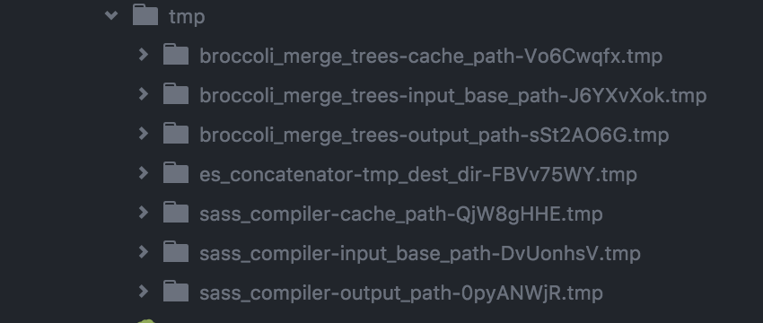
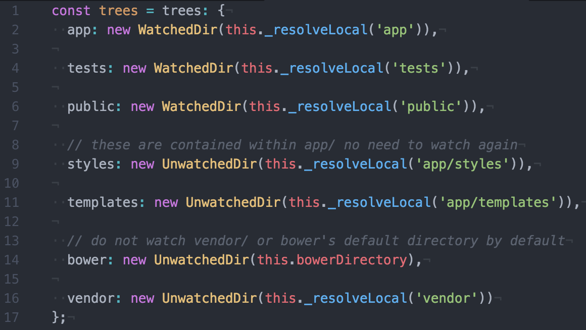

# broccoli-workshop

Presentación e introducción a [broccoli.js](http://broccolijs.com/) en español.

[Check the example page!](https://josex2r.github.io/broccoli-workshop/#/)

## Índice

- [Broccoli.js](#broccoli-js)
- [Arquitectura](#arquitectura)
  - [Trees](#trees)
  - [Encadenamiento](#encadenamiento)
  - [File System API](#file-system-api)
  - [Caché](#cache)
- [Brocfile.js](#brocfile-js)
- [cli](#cli)
- [Plugins](#plugins)
  - [Constructor](#constructor)
  - [Build](#build)
- [Debugging](#debugging)
- [Publicación en npm](#publicacion-en-npm)
- [Broccoli + Ember](#broccoli-ember)

## ¿Qué es broccoli.js?

[broccoli.js](http://broccolijs.com/) es una herramienta que funciona sobre `node.js` para la compilación/construcción de proyectos.

Esta herramienta no es excluyente y se puede combinar con otras como `grunt` ([grunt-broccoli](https://www.npmjs.com/package/grunt-broccoli)) o `gulp`.

Podríamos decir que tiene más parecido con `gulp` porque prevalece la codificación frente a la configuración.

La principal característica de [broccoli.js](http://broccolijs.com/) es la velocidad con la que es capaz de (re)construir proyectos.

## Arquitectura

La principal característica de [broccoli.js](http://broccolijs.com/) es el uso de **trees**.

Un **tree** no es más que un directorio con una serie de ficheros y/o directorios.

Para construir los proyectos se apoya en una serie de **plugins**, que modifican y transforman los ficheros mediante la [File System API](https://nodejs.org/api/fs.html) de `node.js`.

Otra de sus características más importantes es el uso de la `caché`, la cual le otorga esa gran velocidad de construcción sin la necesidad de paralelizar tareas.

### Trees

Como hemos comentado anteriormente, un **tree** es un directorio.

Si lo comparamos con otras herramientas podríamos pensar que un **tree** está formado por un solo fichero o un **stream** de datos, pero al compilar un proyecto entero raramente tenemos que manejar ficheros aislados, utilizamos directorios para agrupar distintos tipos de ficheros.

> tree-goes-in-tree-goes-out

Es por ello que la filosofía principal del framework es procesar **trees** de entrada para devolver un único **tree** de salida.

Ejemlpo:

```javascript
var compileSass = require('broccoli-sass');

var styles = new compileSass(['scss', 'sass-vendors'], 'main.scss', 'app.css');
```

### Encadenamiento

Los plugins son paquetes [npm](https://www.npmjs.com/) que nos permiten abstraernos de tareas complejas y reutilizar herramientas que otras personas han programado.

El encadenamiento de **plugins** es una de las características más importantes y nos permite realizar transformaciones sobre otros trees que devuelven los **plugins**.

Ejemplo:

```javascript
var JSHinter = require('broccoli-jshint');
var esTranspiler = require('broccoli-babel-transpiler');
var concat = require('broccoli-concat');

var tree = new JSHinter('app');
tree = new esTranspiler(tree);
tree = new concat(tree, {
  outputFile: 'app.js'
});
```

### File System API

[broccoli.js](http://broccolijs.com/) utiliza la api nativa de `node.js` para la lectura/escritura de ficheros.

¿Por qué?
Pues porque los plugins leen ficheros, los modifican y los escriben en un directorio temporal y para ello no es necesario crear una nueva herramienta.

Y sí, en este punto ya te estará chirriando las palabras `directorio temporal`, pero junto a el sistema de caché que implementan los **plugins** y que los ordenadores son cada vez más rápidos esto no es un problema.

A continuación aparece un trozo de código que representa a un plugin, en el se puede ver como en la función `build()` se puede acceder a las variables de contexto `this.inputPaths` y `this.outputPath` con las que habrá que interactuar para procesar los ficheros.

```javascript
var Plugin = require('broccoli-plugin');

MyPlugin.prototype = Object.create(Plugin.prototype);
MyPlugin.prototype.constructor = MyPlugin;
function MyPlugin(inputNode) {
  Plugin.call(this, [inputNode]);
}

MyPlugin.prototype.build = function() {
  // Build from this.inputPaths[0] to this.outputPath
};
```

### Caché

Puede chocar que no se paralelicen tareas, pero para optimizar el tiempo que se puede ganar mediante esta técnica se ha incorporado un sistema de cacheado en el que cada plugin persiste su **tree** de salida mediante el uso de la memoria y de un directorio temporal que maneja [broccoli.js](http://broccolijs.com/) automáticamente.

Otros plugins, como [broccoli-caching-writer](https://github.com/ember-cli/broccoli-caching-writer), permiten añadir una comprobación extra persistiendo en memoria un hash que representa los **trees** de entrada.

En el momento que el algún fichero cambie, el hash no coincidirá y se volverá a ejecutar el **plugin**.

En la siguiente imagen podemos ver la carpeta temporal generada por el [ejemplo 1](https://github.com/josex2r/broccoli-workshop/tree/master/examples/example1)




## Brocfile.js

Al igual que `grunt` o `gulp`, también tenemos un fichero principal para ejecutar.

El fichero `Brocfile.js` lo situaremos en el directorio raíz de nuestro proyecto y definiremos todo lo necesario para construir el proyecto.

El único requisito que se nos impone es que se exporte un único **tree**.

```javascript
/* Brocfile.js */

var tree = 'app/';
// @TODO transform tree

module.exports = tree;
```

## cli

También disponemos de una librería que nos provee de los comandos necesarios para ejecutar `broccoli` desde la consola.

Estos comandos se encargarán de ejecutar nuestro `Brocfile.js` de dos maneras diferentes:

- `serve`: Nos permite arrancar un servidor en un determinado puerto, recompilando la aplicación en caso de que modifiquemos un fichero.

```
$ broccoli serve -p 4200
```

- `build`: Es el comando que nos permite compilar la aplicación sin arrancar un servidor. Es útil cuando queremos generar el paquete final.

```
$ broccoli build ./dist
```

## Plugins

Los plugins, nos permiten obtener un único **tree** mediante la transformación de uno o varios **trees**.

Los **plugins** deben exportar una clase que extienda del paquete [broccoli-plugin](https://github.com/broccolijs/broccoli-plugin), con el cual podremos sobreescribir el `constructor`y la función `build()` para realizar las transformaciones que necesitemos.

A la hora de utilizarlos se deben instanciar con la palabra `new` (convención).

### constructor

El constructor de todo **plugin** va a recibir dos parámetros:

- `inputNodes`: Array que contiene **trees**
- `options`: Datos de inicialización
  - `name`: Nombre del **plugin**
  - `annotation`: Texto descriptivo
  - `persistentOutput`: Si el árbol de salida debe ser cacheado

Es necesario llamar al constructor de la clase padre desde nuestro plugin, es por ello que casi todos los plugins se inicializan de la misma manera:

```javascript
var Plugin = require('broccoli-plugin');

// Create a subclass MyPlugin derived from Plugin
MyPlugin.prototype = Object.create(Plugin.prototype);
MyPlugin.prototype.constructor = MyPlugin;
function MyPlugin(inputNodes, options) {
  options = options || {};
  Plugin.call(this, inputNodes, {
    annotation: options.annotation
  });
  this.options = options;
}
```

### Build

Esta función se ejecutará en cada (re)build.
Para realizar las operaciones sobre los **trees** disponemos de una serie de variables de contexto (sólo lectura):

- `this.inputPaths`: Array que contiene **trees**
- `this.outputPath`: Es el la ruta del directorio de salida del plugin. Este directorio se persistirá en el `File System` en función de la variable `persistentOutput`
- `this.cachePath`: Directorio auxiliar de caché (persistente entre builds)

```javascript
MyPlugin.prototype.build = function() {
  var inputBuffer = fs.readFileSync(path.join(this.inputPaths[2], 'foo.txt'));
  var outputBuffer = someCompiler(inputBuffer);

  fs.writeFileSync(path.join(this.outputPath, 'bar.txt'), outputBuffer);
};
```

## Debugging

La parte dolorosa de todo los desarrollos, y como no podían ser menos, nos lo han puesto difícil.

Debugear los árboles de broccoli es una tarea compleja y para ello tendremos que encapsular `trees` dentro de otros `trees`.

Afortunadamente tenemos algunos paquetes que nos dan herramientas para facilitarnos el trabajo, como broccoli-stew[(https://github.com/stefanpenner/broccoli-stew)].

## Publicación en npm

Simplemente añade la keyword `broccoli-plugin` a tu fichero `package.json`.

## Broccoli + Ember

> [https://github.com/ember-cli/ember-cli/blob/master/lib/broccoli/ember-app.js#L199](https://github.com/ember-cli/ember-cli/blob/master/lib/broccoli/ember-app.js#L199)


